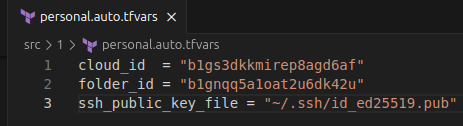
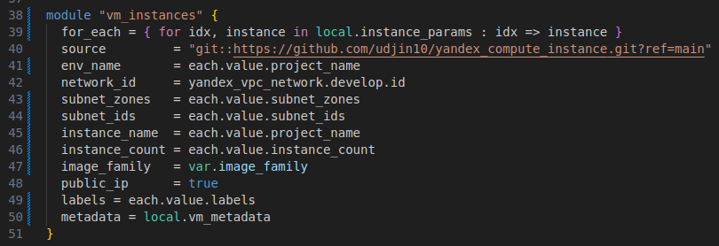
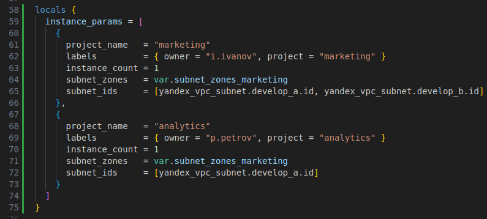
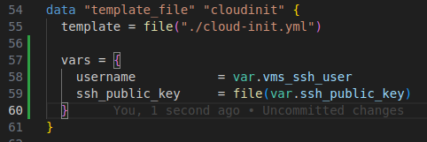
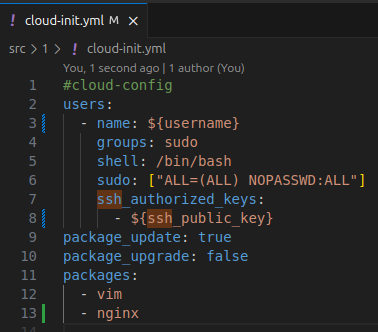
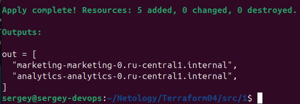
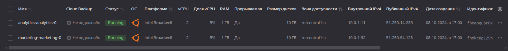
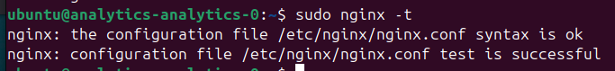
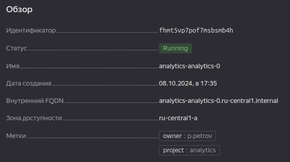
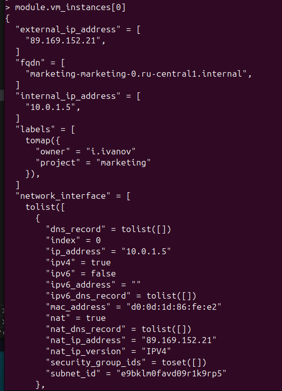

[Задание](https://github.com/netology-code/ter-homeworks/blob/main/04/hw-04.md)

## [Задание 1](tasks/task1.md)

#### 1. 
Копируем пример из [демонстрации] в папку [src/1](src/1)  

Объявляем переменные в [variables.tf](src/1/variables.tf)  

Создаём `personal.auto.tfvars` по образцу [`personal.auto.tfvars_example`](src/1/personal.auto.tfvars_example), добавляем также переменную с именем файла публичного ключа  
  

Для избежания дублирования одного и того же модуля под разными именами объединяем два вызова модуля в цикл  
  

Если используем циклы, то нужно поменять и [`remote_state_outputs.tf`](src/1/remote_state_outputs.tf)  

и создаём локальную переменную в качестве списка map для каждой итерации цикла  
  

Добавляем переменные для передачи в template  
  

В [`template`](src/1/cloud-init.yml) подставляем эти переменные и добавляем установку nginx  
  

Запускаем `terraform init`, `terraform plan`, `terraform apply`  

Машины создались:  
  

  

Проверяем  
  
Метки  
  
`module.vm_instances[0]`  
  
