[Задание](https://github.com/netology-code/ter-homeworks/blob/main/04/hw-04.md)

## [Задание 1](tasks/task1.md)
Копируем пример из [демонстрации] в папку [src/1](src/1)  

Объявляем переменные в [variables.tf](src/1/variables.tf)  

Создаём `personal.auto.tfvars` по образцу [`personal.auto.tfvars_example`](src/1/personal.auto.tfvars_example), добавляем также переменную с именем файла публичного ключа  
  

Для избежания дублирования одного и того же модуля под разными именами объединяем два вызова модуля в цикл  
  

Если используем циклы, то нужно поменять и [`remote_state_outputs.tf`](src/1/remote_state_outputs.tf)  
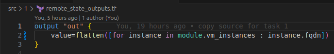  

и создаём локальную переменную в качестве списка map для каждой итерации цикла  
  

Добавляем переменные для передачи в template  
  

В [`template`](src/1/cloud-init.yml) подставляем эти переменные и добавляем установку nginx  
  

Запускаем `terraform init`, `terraform plan`, `terraform apply`  

Машины создались:  
  

  

Проверяем  
  
Метки  
  
`module.vm_instances[0]`  
  

[Commit](https://github.com/SergueiMoscow/DevOps-Terraform-04/commit/05f69029fd21f55a790c1ad27417e6e757d15655)

## [Задание 2](tasks/task2.md)
Создаём каталог `modules`, в нём каталог для модуля `vpc`

Создаём [variables.tf](src/1/modules/vpc/variables.tf) для модуля

Создаём [main.tf](src/1/modules/vpc/main.tf) для модуля

Создаём [outputs.tf](src/1/modules/vpc/outputs.tf) для модуля

В основном [main.tf](src/1/main.tf) удаляем ресурсы сети и одной подети  
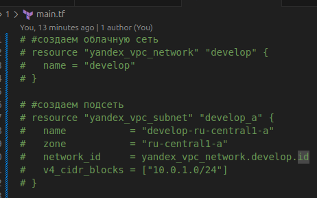  

Вместо них вызываем модуль:  
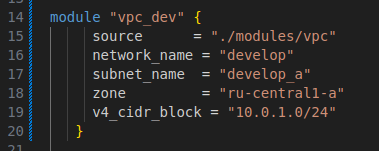  

Также меняем ссылки, вместо удалённых сети и подсети подставляем значения модуля:  
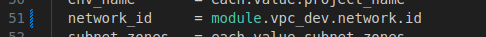  

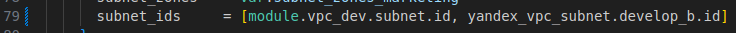

После `terraform apply` видим такой вывод:  
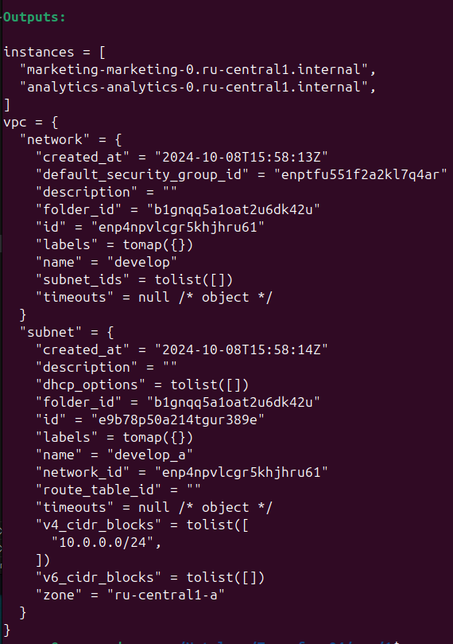

Из консоли `module.vpc_dev`  
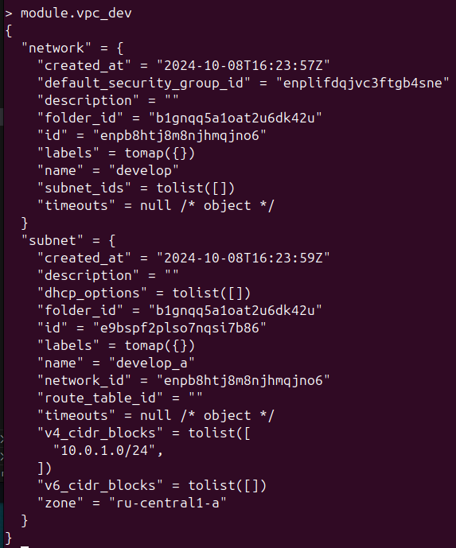

[Commit](https://github.com/SergueiMoscow/DevOps-Terraform-04/commit/f76ea5e88c71e825f3761bb618e42a6c185b5c10)

## [Задание 3](tasks/task3.md)
`terraform state list`  
```
data.template_file.cloudinit
yandex_vpc_subnet.develop_b
module.vm_instances["0"].data.yandex_compute_image.my_image
module.vm_instances["0"].yandex_compute_instance.vm[0]
module.vm_instances["1"].data.yandex_compute_image.my_image
module.vm_instances["1"].yandex_compute_instance.vm[0]
module.vpc_dev.yandex_vpc_network.this
module.vpc_dev.yandex_vpc_subnet.this
```

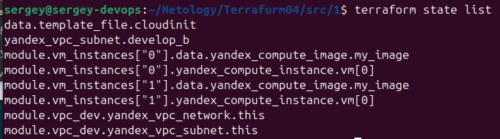

`terraform state rm module.vpc_dev`  
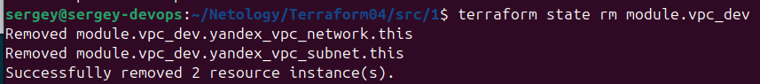

`terraform state rm module.vm_instances`  
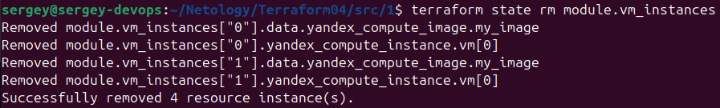

`terraform state import module.vpc_dev.yandex_vpc_network.this <id>`  
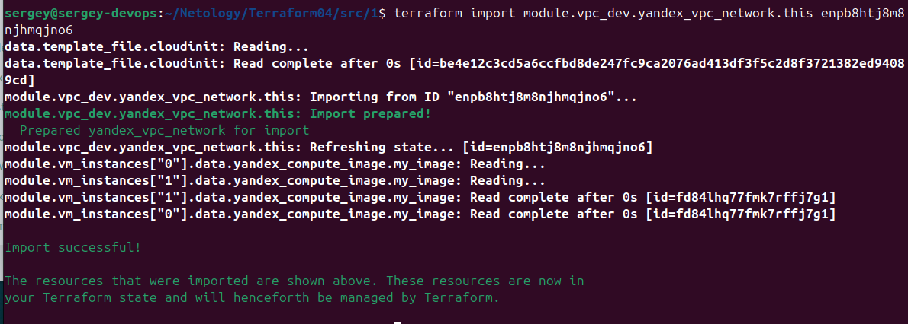

`terraform import module.vpc_dev.yandex_vpc_subnet.this <id>`  
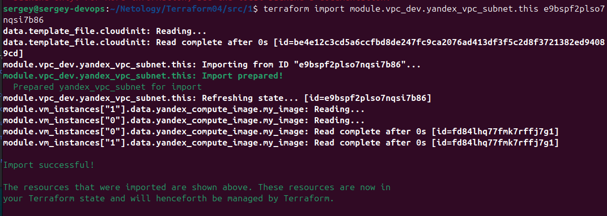

`terraform import module.vm_instances[\"0\"].yandex_compute_instance.vm[0] fhm9dnimtu3gs697k2bt`  
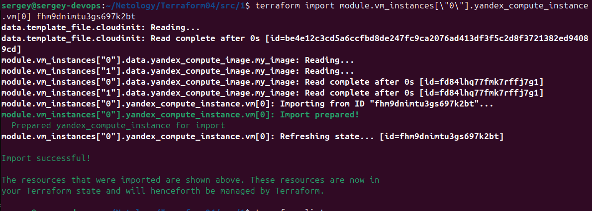

Выполняем:
```
terraform state list
terraform import module.vm_instances[\"1\"].yandex_compute_instance.vm[0] fhmq3j09ct7l3sf45f8t
terraform state list
```  
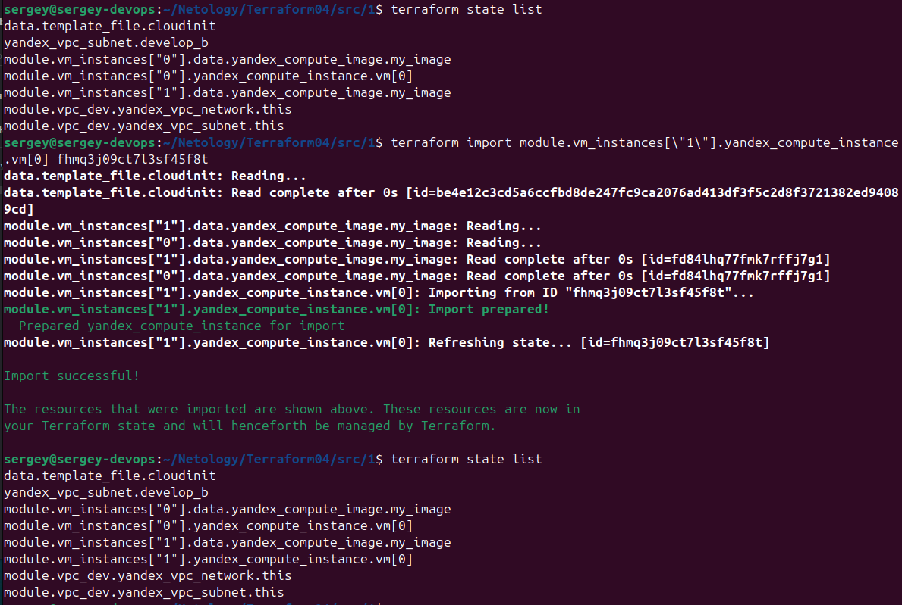

```
data.template_file.cloudinit
yandex_vpc_subnet.develop_b
module.vm_instances["0"].data.yandex_compute_image.my_image
module.vm_instances["0"].yandex_compute_instance.vm[0]
module.vm_instances["1"].data.yandex_compute_image.my_image
module.vm_instances["1"].yandex_compute_instance.vm[0]
module.vpc_dev.yandex_vpc_network.this
module.vpc_dev.yandex_vpc_subnet.this

```
`terraform plan`  
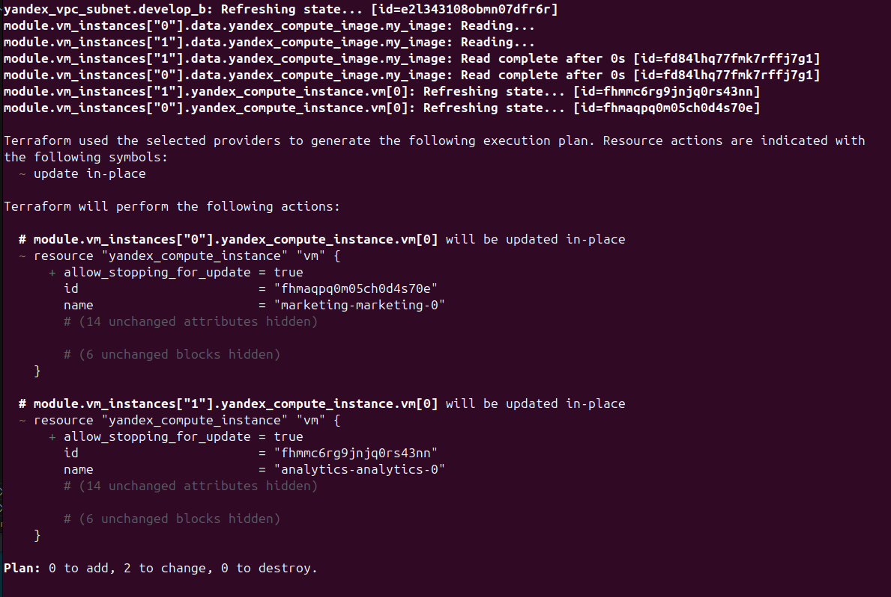

`terraform apply` отработал корректно  
 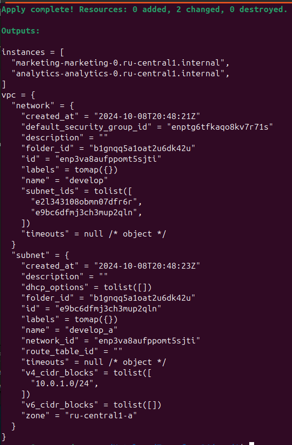

Обнаружил, что можно использовать другой вариант создания instances, заменив `for_each`:  
`  for_each = local.instance_params`
Тогда `instance_params` должен быть `map`:  
```
locals {
  instance_params = {
    marketing = {
      project_name   = "marketing"
      labels         = { owner = "i.ivanov", project = "marketing" }
      instance_count = 1
      subnet_zones   = var.subnet_zones_marketing
      subnet_ids     = [module.vpc_dev.subnet.id, yandex_vpc_subnet.develop_b.id]
    },
    analytics = {
      project_name   = "analytics"
      labels         = { owner = "p.petrov", project = "analytics" }
      instance_count = 1
      subnet_zones   = var.subnet_zones_marketing
      subnet_ids     = [module.vpc_dev.subnet.id]
    }
  }
}
```
и instances получаются такими:  
```
data.template_file.cloudinit
yandex_vpc_subnet.develop_b
module.vm_instances["analytics"].data.yandex_compute_image.my_image
module.vm_instances["analytics"].yandex_compute_instance.vm[0]
module.vm_instances["marketing"].data.yandex_compute_image.my_image
module.vm_instances["marketing"].yandex_compute_instance.vm[0]
module.vpc_dev.yandex_vpc_network.this
module.vpc_dev.yandex_vpc_subnet.this
```
